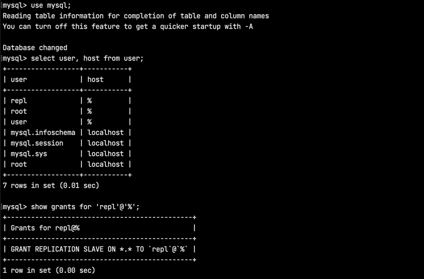
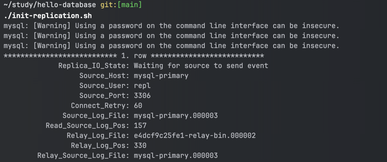

# Hello Database

## Replication

### Replication 구성 하는 방법

> 아래의 절차는 간략하게 구성되어 있으므로, 더 자세한 내용은 공식문서를 참고하는 것이 좋다.

#### 1. Primary 서버 설정

바이너리 파일 위치 기반 복제를 사용하도록 구성하기 위해서는, 먼저 바이너리 로깅을 사용하도록 설정하고 고유한 서버 ID를 가지고 있어야 한다.

- 복제 토폴로지 내의 각 서버는 고유한 서버 ID로 구성되어야 한다. 이 서버 ID는 복제 토폴로지 안에서 개별 서버를 식별하는 데 사용되며, `1 ~ (2^32 - 1)`의 값으로 설정해야 한다.
- 바이너리 로그는 원본에서 복제본으로 변경 내용을 복제하기 위한 기초가 되므로 원본의 바이너리 로깅 설정이 필요하다. 바이너리 로깅은 기본적으로 활성화 되어 있다.
- `log-bin` 옵션은 바이너리 로그 파일이 사용할 기본 이름을 서버에 알려준다. 이를 통해 호스트 이름이 변경되어도 동일한 이진 로그 파일 이름을 사용할 수 있다.

#### 2. Replica 서버 설정

각 복제본 서버는 고유한 서버 ID를 가지고 있어야 한다. 복제본 서버의 서버 ID가 0인 경우, 원본 서버에 연결할 수 없다는 점에 주의해야 한다. 이 경우 새로운 서버 ID를 설정하고 서버를 재시작해야 한다.

Replication을 구성할 때, 기본적으로 바이너리 로깅이 켜져있긴 하지만 복제본 서버에서 바이너리 로깅을 반드시 활성화할 필요는 없다. 그렇지만 복제본 서버의 바이너리 로그를 데이터 백업 및 장애 복구에 사용할 수 있을 뿐만 아니라, 바이너리 로깅을 활성화 함으로서 복잡한 복제 토폴로지를 구성하는데 도움을 줄 수 있으므로 굳이 비활성화할 필요는 없다.

#### 3. Replication을 사용할 유저 생성

각 복제본 서버는 MySQL 사용자 이름과 비밀번호를 사용하여 원본 서버에 연결하므로 복제본 서버가 연결에 사용할 수 있는 사용자 계정이 원본 서버에 있어야 한다.

복제 전용 계정을 만들 필요는 없지만, 복제 사용자 이름과 비밀번호는 복제본의 연결 메타데이터 리포지토리 `mysql.slave_master_info`에 일반 텍스트로 저장된다는 점에 유의해야 한다. 따라서 복제에 대한 권한만 있는 별도의 계정을 만들어서 다른 계정에 대한 침해 가능성을 줄일 수 있다.

```sql
CREATE USER 'repl'@'%' IDENTIFIED BY 'password';
GRANT REPLICATION SLAVE ON *.* TO 'repl'@'%';
```

- 새 계정을 만들기 위해 `CREATE USER` 를 진행한다.
- 복제 목적으로만 계정을 만드는 경우, `REPLICATION SLAVE` 권한만 필요하므로 `GRANT` 명령을 통해 권한을 부여한다.

#### 4. Source의 복제 바이너리 좌표 확보

만약 데이터 스냅샷을 만들기 위해 원본 서버를 종료하는 경우, 선택적으로 이 단계를 건너뛰고 대신 데이터 스냅샷과 재시작 할 때 함께 바이너리 로그 인덱스 사본을 저장하게 할 수 있다.

복제본이 복제 프로세스를 시작해야 하는 소스 바이너리 로그 좌표는 복사된 바이너리 로그 인덱스 파일에 나열된 파일 다음에 있는 소스에서 다음 바이너리 로그 파일인 새 파일의 시작점이다.

1. Command Line 클라이언트로 세션을 시작하고, 모든 테이블을 플러시하고 읽기 잠금으로 테이블을 플러시하는 쓰기 문을 차단하는 `FLUSH TABLES WITH READ LOCK` 문을 실행한다.
2. `SHOW MASTER STATUS` 명령을 통해 현재 바이너리 로그 파일과 위치를 확인한다.

다음 단계부터는, 원본 서버에 데이터가 있는지, 없는지 여부로 달라진다. 기존 데이터가 있는 경우 클라이언트를 계속 실행해서 잠금이 유지되도록 한다. 이렇게 하면 더 이상 데이터의 변경이 이뤄지지 않으므로 복제본 서버에 원본 서버의 데이터 스냅샷을 복사해서 데이터를 동기화시킬 수 있다.

원본 서버에 데이터가 없다면 세션을 종료하여 읽기 잠금을 해제 한 후 복제본 서버의 설정을 진행한다. 여기서는 빈 데이터베이스로 예제를 진행했으므로 복제본 서버의 설정을 진행한다.

#### 5. Replica 서버 설정

가져올 데이터 스냅샷이 없는 경우, 원본 서버에서 복제를 시작하도록 복제본을 구성한다. 

복제를 위해 원본과 통신하도록 복제본을 설정하려면 필요한 연결 정보로 복제본을 구성한다. 먼저 복제본 서버를 실행한다. 그 다음 복제본에서 `CHANGE REPLICATION SOURCE TO` 명령을 통해 옵션 값을 설정해줘야 한다.

```sql
CHANGE REPLICATION SOURCE TO
  SOURCE_HOST='source_host_name',
  SOURCE_USER='replication_user_name',
  SOURCE_PASSWORD='replication_password',
  SOURCE_LOG_FILE='recorded_log_file_name',
  SOURCE_LOG_POS=recorded_log_position;
```

### 실습

도커 컴포즈를 활용해서 원본 MySQL 서버와 복제봅 MySQL을 띄워서 실습해보자.

#### 1. `primary.cnf`, `replica.cnf` 설정

`primary.cnf`와 `replica.cnf` 파일을 통해서 복제 토폴로지에서 서버를 구분하기 위한 서버 ID를 고유하게 지정해준다.

```text
### primary.cnf
server-id=1
log_bin=mysql-primary

### replica.cnf
server-id=2
log_bin=mysql-replica
```

- server-id 를 고유하게 지정해준다.
- log_bin 을 통해 binary log 파일 이름을 지정해준다.

#### 2. `init-primary/init.sql` 작성

복제시 사용할 유저를 생성하고, 복제에 대한 권한을 지정해준다.

```sql
CREATE USER 'repl'@'%' IDENTIFIED BY 'password';
GRANT REPLICATION SLAVE ON *.* TO 'repl'@'%';
FLUSH PRIVILEGES;
```

#### 3. `docker-compose.yml` 작성

`mysql-primary`, `mysql-replica` 로 나눠 원본, 복제본 MySQL 컨테이너를 띄운다. 두 컨테이너가 같은 포트 번호를 사용하지 않게 포트 번호를 바꿔서 정해준다.

그리고 앞서 작성한 `primary.cnf`, `replica.cnf`, `init-primary/init.sql` 을 컨테이너가 실행될 때 등록될 수 있도록 volume 설정을 해준다.

이후 `docker compose up -d` 명령을 통해서 실행해준다.

- `mysql-primary`에 접속해서 유저가 정상적으로 잘 생성되었는지 확인해본다.

```text
### 컨테이너 접속
docker exec -it mysql-primary bash

### mysql 접속
mysql -u root -proot

### 유저 생성 확인 및 권한 확인
use mysql;
select user, host from user;
show grants for 'repl'@'%';
```



#### 4. `init-replication.sh` 실행

이후, 복제를 위해서 원본의 바이너리 로그 파일의 이름과 번호를 알아야 한다. 

```text
STATUS=$(docker exec mysql-primary sh -c 'mysql -u root -proot -e "SHOW MASTER STATUS"')
CURRENT_LOG=$(echo $STATUS | awk '{print $6}')
CURRENT_POS=$(echo $STATUS | awk '{print $7}')
```

이를 위 명령어로 실행해 출력된 결과를 `STATUS` 에 저장한다. 그리고 이를 띄워쓰기 기준으로 파싱하여 바이너리 로그 파일의 이름과 위치를 파악한다.

이후, 파악한 정보를 가지고 복제본 서버 설정을 해준다.

```text
SET_PRIMARY_SQL="CHANGE REPLICATION SOURCE TO \
  SOURCE_HOST='$SOURCE_HOST', \
  SOURCE_USER='$SOURCE_USER', \
  SOURCE_PASSWORD='$SOURCE_PASSWORD',\
  SOURCE_LOG_FILE='$CURRENT_LOG',\
  SOURCE_LOG_POS=$CURRENT_POS;START REPLICA;"

docker exec mysql-replica sh -c "mysql -u root -proot -e \"$SET_PRIMARY_SQL\""
```

다음과 같은 명령어를 통해서 `mysql-replica` 에 옵션 값을 설정해준다.

```text
docker exec mysql-replica sh -c "mysql -u root -proot -e 'SHOW REPLICA STATUS\G'"
```

이후 `SHOW SLAVE STATUS` 명령어를 통해서 원본 서버가 잘 등록되었는지 확인한다.



## Reference

- https://dev.mysql.com/doc/refman/8.0/en/replication.html
- https://pierreabreu.medium.com/how-to-create-master-slave-mysql-8-with-docker-compose-yml-c137f45e28c7
