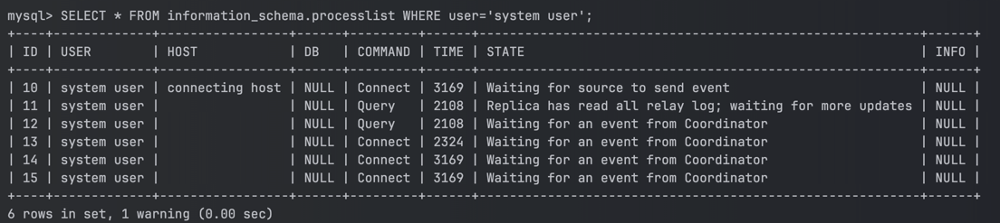

## Replication 

복제를 사용하면 하나의 MySQL 데이터베이스 서버의 데이터를 또 다른 하나 이상의 MySQL 데이터베이스 서버에 복사할 수 있다. 

복제는 기본적으로 비동기식으로 동작한다. 원본 서버에서 업데이트를 받기 위해 복제본 서버를 영구적으로 연결할 필요는 없다. 복제의 구성에 따라 모든 데이터베이스, 선택한 데이터베이스 또는 데이터베이스 내의 선택한 테이블까지 복제할 수 있다.

### 복제의 장점

#### 확장형 솔루션

여러 복제본 서버끼리 부하를 분산해 성능을 향상시킬 수 있다. 이 구성에서는 모든 쓰기 작업은 원본 서버에서 이루어져야 한다. 읽기 작업은 하나 이상의 복제본에서 수행할 수 있다. 이 구성은 쓰기 성능을 향상시키는 동시에(원본 서버만 쓰기 작업을 하므로) 증가하는 복제본 서버 수에 걸쳐 읽기 속도를 높일 수 있다.

#### 데이터 보호

복제본 서버가 복제 프로세스를 일시 중지할 수 있으므로, 해당 원본 데이터를 손상시키지 않고 복제본에서 백업 서비스를 실행할 수 있다.

#### 분석

원본 서버에서 실시간 데이터를 생성할 수 있으며 원본 서버의 성능에 영향을 주지 않고 복제본 서버에서 정보 분석을 수행할 수 있다.

#### 장거리 데이터 분산

복제를 사용하면 원본 서버에 영구적으로 접근하지 않고 원격 사이트에서 사용할 데이터의 로컬 복사본을 만들 수 있다.

### MySQL 복제 방법

#### 바이너리 기반 복제

원본 서버의 바이너리 로그에서 이벤트를 복제하는 것을 기반으로 하며, 로그 파일과 그 안의 위치가 소스와 복제본 서버 간에 동기화되어야 한다.

1. 복제 서버가 초기화 되면 2개의 스레드 작업을 초기화한다.
2. 하나는 I/O 스레드로, 원본 서버에 연결해 바이너리 로그를 읽어서 복제 서버의 릴레이 로그에 읽은 내용을 복사한다.
3. 다른 스레드는 SQL 스레드로 릴레이 로그를 읽고 복제 서버에 이를 반영하는 역할을 한다.

#### GTID 기반 복제

GTID(global transaction identifier)를 기반으로 하는 방법은 트랜잭션기반으로, 로그 파일이나 이러한 파일 내의 위치에 대한 작업이 필요하지 않으므로 복제 작업이 크게 단순화된다. GTID를 사용한 복제는 원본 서버에서 커밋된 모든 트랜잭션이 복제본 서버에도 적용되므로 원본과 복제본 간의 일관성을 보장한다.

## Reference

- https://dev.mysql.com/doc/refman/8.0/en/replication.html
- https://escapefromcoding.tistory.com/710
