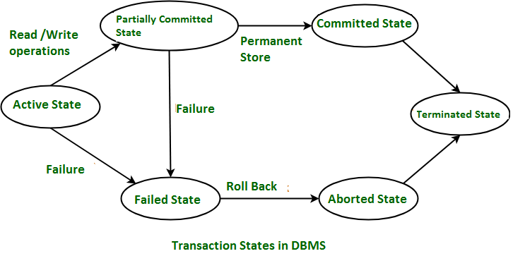

## 트랜잭션

트랜잭션이란 데이터베이스의 상태를 변환시키는 하나의 논리적 기능을 수행하기 위한 작업의 단위 또는 한꺼번에 모두 수행되어야 할 일련의 연산들을 의미한다. 이를 통해서 작업의 완전성을 보장한다.

하나의 트랜잭션은 commit되거나 rollback된다. 트랜잭션 완료 후 성공적인 완료가 시스템에 반영되거나 트랜잭션이 실패하고 변경 사항이 반영되지 않는다.

### 트랜잭션 주의점

- 트랜잭션은 꼭 필요한 최소의 코드에만 적용하는 것이 좋다. 즉, 트랜잭션의 범위를 최소화해야 한다.
- 일반적으로 데이터베이스의 커넥션의 수는 정해져 있으므로, 각 단위 프로그램이 커넥션을 소유하는 시간이 길어진다면 사용 가능한 여유 커넥션의 개수는 줄어들게 된다.

### 트랜잭션의 성질

#### 원자성(Atomicity)

트랜잭션의 연산이 데이터베이스에 모두 반영되든지 아니면 전혀 반영되지 않아야 한다는 것을 의미한다. 즉, 여러 쓰기 작업이 하나의 원자적인 트랜잭션으로 묶여있는데 결함 때문에 완료될 수 없다면 실패하고 데이터베이스는 이 트랜잭션에서 지금까지 실행한 쓰기를 무시하거나 취소해야 한다.

만약 원자성이 없다면 여러 변경사항을 적용하는 도중 오류가 발생하면 어떤 변경은 반영되고, 어떤 것은 반영되지 않은지를 알기가 쉽지 않다. 애플리케이션에서 재시도할 수 있지만 동일한 변경이 두 번 실행돼서 중복되거나 잘못된 데이터가 만들어질 수 있다.

#### 일관성(Consistency)

트랜잭션이 수행된 이후에도 데이터베이스는 언제나 일관성 있는 데이터를 보장해야 한다는 것을 의미한다.

#### 격리성(Isolation)

여러 트랜잭션이 동시에 수행되더라도 각각의 트랜잭션은 서로 간섭없이 독립적으로 수행되어야 한다는 것을 의미한다. 즉, 트랜잭션은 다른 트랜잭션을 방해할 수 없다.

#### 지속성(Durability)

성공적으로 완료된 트랜잭션의 결과는 데이터베이스에 영구적으로 저장되어야 한다는 것을 의미한다. 지속성을 보장하려면 데이터베이스는 트랜잭션이 성공적으로 커밋됐다고 보고하기 전에 쓰기나 복제가 완료될 때까지 가디려야 한다.

> ACID 표준을 따르지 않는 시스템은 때로 BASE라고 불린다. 기본적으로 가용성을 제공하고(Base Available), 유연한 상태를 가지며(Soft state), 최종적 일관성(Eventual consistency)을 지닌다는 뜻이다.   
> ACID의 정의보다 더 모호하다.

### 트랜잭션 상태

- 활동(Active) : 트랜잭션이 실행 중에 있는 상태, 연산들이 정상적으로 실행 중인 상태
- 부분 완료(Partially Committed) : 트랜잭션이 마지막 연산까지 실행했지만, Commit 연산이 실행되기 직전의 상태
- 완료(Committed) : 트랜잭션이 성공적으로 종료되어 변경사항이 데이터베이스에 적용되고 트랜잭션이 완료된 상태
- 실패(Failed) : 트랜잭션이 실행에 오류가 발생하여 중단된 상태
- 철회(Aborted) : 트랜잭션이 비정상적으로 종료되어 Rollback 연산을 수행한 상태
- 종료(Terminated) : 이전 트랜잭션이 종료된(롤백되었던지, 커밋되었던지) 상태 

## Reference

- 데이터 중심 애플리케이션 설계
- https://www.geeksforgeeks.org/transaction-states-in-dbms
