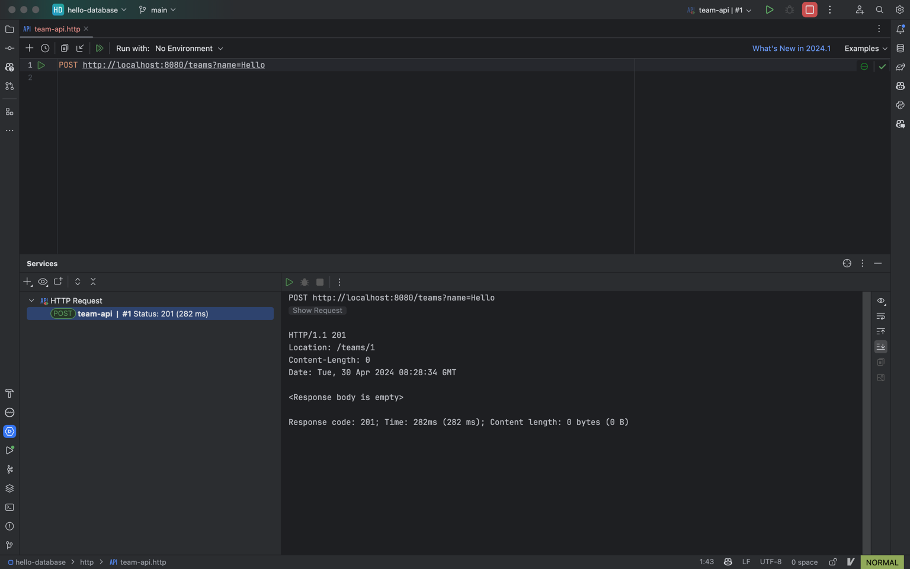
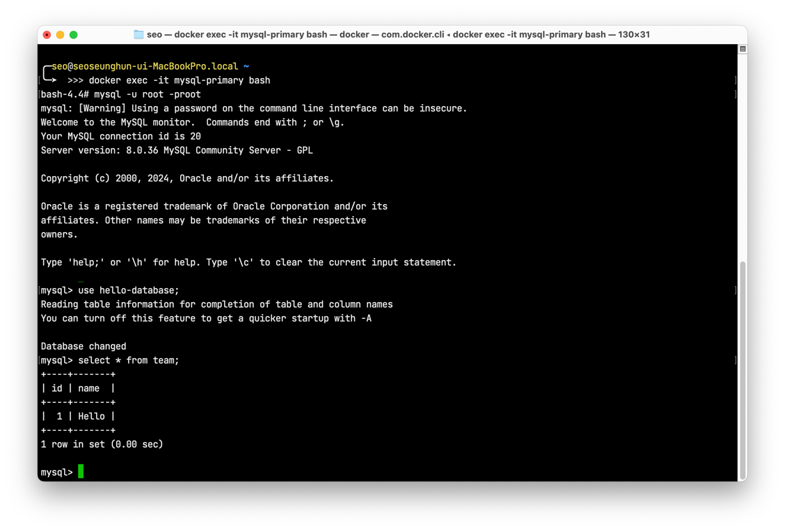
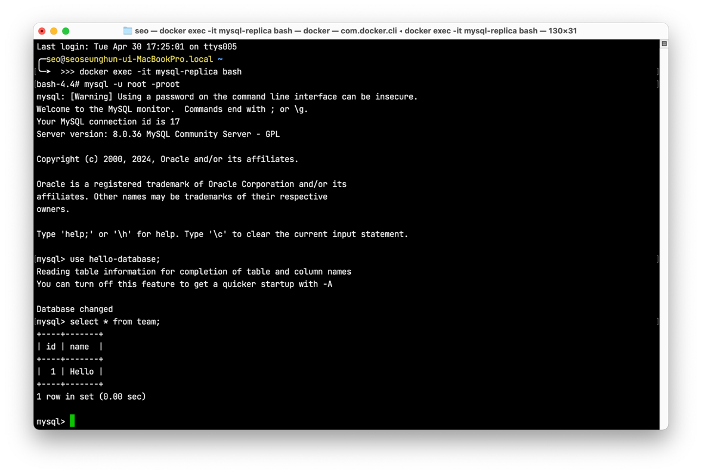

## Replication 동작하는지 확인해보기

### 1. 먼저 생성한 Primary, Replica 데이터베이스의 DataSource를 구성한다.

`application.yml`

```yml
spring:
  datasource:
    write:
      driver-class-name: com.mysql.cj.jdbc.Driver
      jdbc-url: jdbc:mysql://localhost:3307/hello-database
      username: user
      password: password
    read:
      driver-class-name: com.mysql.cj.jdbc.Driver
      jdbc-url: jdbc:mysql://localhost:3308/hello-database
      username: user
      password: password
```

다음과 같이 Primary를 Write DataSource로 Replica를 Read DataSource로 등록한다.

```kotlin
// DatabaseConfig
@Bean
@ConfigurationProperties(prefix = "spring.datasource.read")
fun readDataSource(): DataSource {
    return DataSourceBuilder.create().type(HikariDataSource::class.java).build()
}

@Bean
@ConfigurationProperties(prefix = "spring.datasource.write")
fun writeDataSource(): DataSource {
    return DataSourceBuilder.create().type(HikariDataSource::class.java).build()
}
```

### 2. 다중 DataSource에서 routing하기 위해 `AbstractRoutingDataSource`를 구현한다.

`AbstractRoutingDataSource`는 여러 DataSource를 등록해서 사용하는 경우, 특정 상황에 맞게 원하는 DataSource를 선택핤 수 있도록 도와주는 추상 클래스이다.

- `setTargetDataSources(Map<Object, Object> ...)`메서드는 Map객체에 String으로 지정한 키 값으로 DataSource를 불러올 수 있도록 지정할 수 있다. 
- `setDefaultTargetDataSource(DataSource ...)`메서드를 통해서 기본 DataSource를 지정해줄 수 있다.
- `determineCurrentLookupKey()`메서드를 오버라이드해서 원하는 상황에 원하는 키 값을 찾도록 구현할 수 있다.

```kotlin
class ReplicationRoutingDataSource : AbstractRoutingDataSource() {

    override fun determineCurrentLookupKey(): Any {
        val isReadOnly = TransactionSynchronizationManager.isCurrentTransactionReadOnly()
        return if (isReadOnly) READ else WRITE
    }
}
```

- `TransactionSynchronizationManager.isCurrentTransactionReadOnly()`를 활용해서 `readOnly = true`인 경우 Read, 아닌 경우 Write를 키로 설정한다.

```kotlin
// DatabaseConfig
@Bean
fun routingDataSource(
    @Qualifier("writeDataSource") writeDataSource: DataSource,
    @Qualifier("readDataSource") readDataSource: DataSource
): DataSource {
    val dataSourceMap: MutableMap<Any, Any> = HashMap()
    dataSourceMap[WRITE] = writeDataSource
    dataSourceMap[READ] = readDataSource

    return ReplicationRoutingDataSource().also {
        it.setTargetDataSources(dataSourceMap)
        it.setDefaultTargetDataSource(writeDataSource)
    }
}
```

### 3. `LazyConnectionDataSourceProxy` 설정

스프링은 트랜잭션 시작 시 Connection의 실제 사용과 무관하게 Connection을 확보한다. 이 때, LazyConnectionDataSourceProxy를 사용하면 트랜잭션이 시작하더라도 필요할 때만 DataSource에 Connection을 할당한다. 

RoutingDataSource를 LazyConnectionDataSourceProxy로 감싸서, Transaction 동기화 이전에 Connection Proxy 객체를 확보하고, 실제 쿼리가 호출될 때 DataSource에 Connection을 할당할 수 있다. 즉, LazyConnectionDataSourceProxy로 감싸지 않으면 `readOnly` 여부를 파악할 수 없게 된다.

```kotlin
// DatabaseConfig
@Bean
@Primary
fun routingLazyDataSource(@Qualifier("routingDataSource") routingDataSource: DataSource): DataSource {
    return LazyConnectionDataSourceProxy(routingDataSource)
}
```

### 4. 간단한 쓰기 작업 실행

Hello-Database는 `Team`, `Player` 테이블을 가지고 있고, 여기서 `Team` 테이블에 데이터를 추가해보자.

> JPA를 활용해 Team 객체를 저장하는 코드는 이미 작성되어 있다고 가정하자.

```http request
POST http://localhost:8080/teams?name=Hello
```



실행한 뒤, ID를 1로 하는 데이터가 생성된 것을 확인할 수 있다.

이후, mysql-primary로 가서 `select * from team;` 해본 결과 `name`이 Hello인 데이터가 잘 생성된 것을 확인할 수 있다.



그리고 mysql-replica로 가서 잘 복제되었는지 확인해보자.



다음과 같이 복제가 잘 동작되는 것을 확인할 수 있다.

## Reference

- https://supawer0728.github.io/2018/05/06/spring-boot-multiple-datasource
- https://wildeveloperetrain.tistory.com/130
- https://wave1994.tistory.com/177
